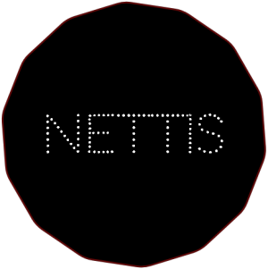

<p align="center">
  
</p>

# nettis 

nettis is BA-zone whois builder that should be cheap to keep alive and cost
totally 0 to make.

Usage: **To scan and map a network in Bosnia and Herzegovina, including host and
domains. To build an open database.**

`nettis` is built to be fast and efficient, natively compiled using Crystal. It
uses POSIX syscalls and requires a few dependencies. A part of this software is
OCR recongition which is closed source.  
  
Storage is simple as file/cache blob and is pushed to remote repo. A proper GIST
control would be awesome (e.g. to offer JSON dataset).
  
Few hints how it works: `uses textual db`, `answer based on return code`,
`pushes on remote`, `always scans the network`, `runs on a simple Pi (cluster)`,
`scan zone domains`, `hostaddr to domains (reverse)`, and much more, just read
the source code.
  
* Bot never asleep (if required, create queue-like env)
* We are getting newest, but also older zone domains (build database)
* Extract status and try to hit the list!
* Good collection. Nice one!
  
## Installation
  
nettis is developed in Crystal (Ruby-like) language that is compiled. This makes
nettis quite fast, with some benchmarking up to 3 times faster then in if it was
written in Ruby!
  
This project was developed and tested on RHEL and will follow in that direction.

```
# # => Add Crystal GPGK
$ curl https://dist.crystal-lang.org/rpm/setup.sh | sudo bash

# # => Install Crystal
$ sudo yum install crystal

# # => Build shards
$ (nettis) ~ shards build

# # Compiled to ./bin/.
```

## Usage

Once you compiled binaries, you have a command line interface to do whatever you
prefer, either `whois` or enumurate new domains. Read full documentation
[here](#documentation).

Example:
  
```
$ bin/nettis last 5

...
Scanning for last 5 domains registered on http://nic.ba
Extracting status for zone extension ..
Status: BA - 19845 # ORG.BA 58 # NET.BA 11 # GOV.BA 182 # EDU.BA 251

Found latest registered domain: bbbbb.ba
Found latest registered domain: aaaaa.ba
...
```

Command line interface:
  
```
# # => Execute
$ bin/nettis

                       /$$     /$$     /$$
                      | $$    | $$    |__/
 /$$$$$$$   /$$$$$$  /$$$$$$ /$$$$$$   /$$  /$$$$$$$
| $$__  $$ /$$__  $$|_  $$_/|_  $$_/  | $$ /$$_____/
| $$  \ $$| $$$$$$$$  | $$    | $$    | $$|  $$$$$$
| $$  | $$| $$_____/  | $$ /$$| $$ /$$| $$ \____  $$
| $$  | $$|  $$$$$$$  |  $$$$/|  $$$$/| $$ /$$$$$$$/
|__/  |__/ \_______/   \___/   \___/  |__/|_______/
Welcome to nettis! v0.1.0 --Zone builder for .BA domains

  nettis

  Usage:
    nettis [command] [arguments]

  Commands:
    about           # Show information about `nettis` and how it's used.
    help [command]  # Help about any command.
    last <#>        # Show last (max) 5 domains registered in zone.
    whois <domain>  # Execute a whois on domain and OCR-to-ASCII.

  Flags:
    -h, --help  # Help for this command. default: 'false'.

```

## Documentation

To generate API and code docs use `yard` with specified code path.

```
$ yardoc src/**/*.cr
```

## Development

Includes: **CHANGELOG**

Remotes:

* Hostname to IP: [nic.ba](http://nic.ba/ajax.php?a=gethostbyname&host=nic.ba)

## Contributing

1. Fork it ( https://github.com/duraki/nettis/fork )
2. Create your feature branch (git checkout -b nettis-is-fun)
3. Commit your changes (git commit -am 'add: some stuff')
4. Push to the branch (git push origin nettis-is-fun)
5. Create a new Pull Request

## Contributors

- [[duraki]](https://github.com/duraki) Halis Duraki - creator, maintainer
